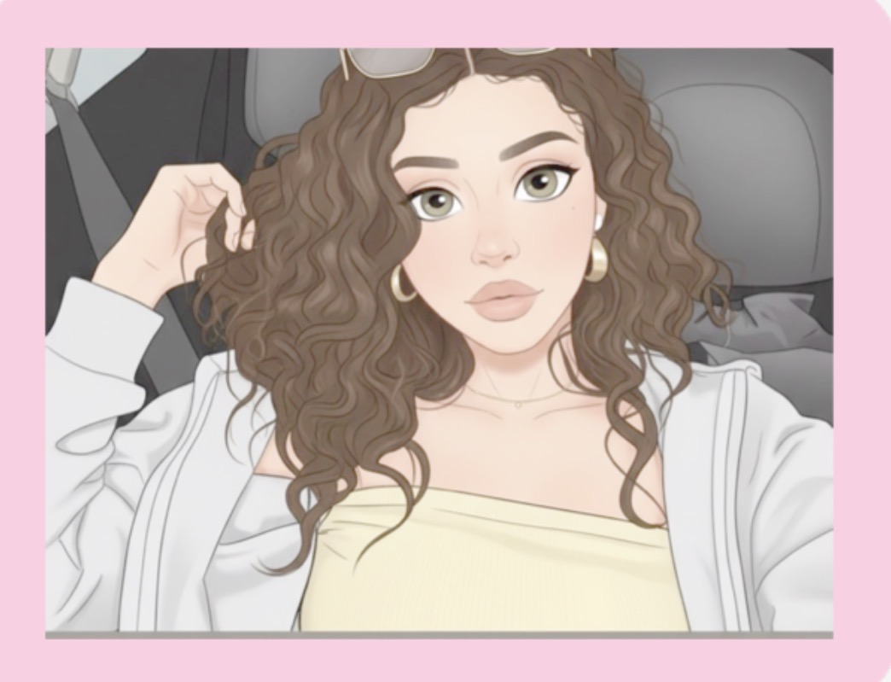
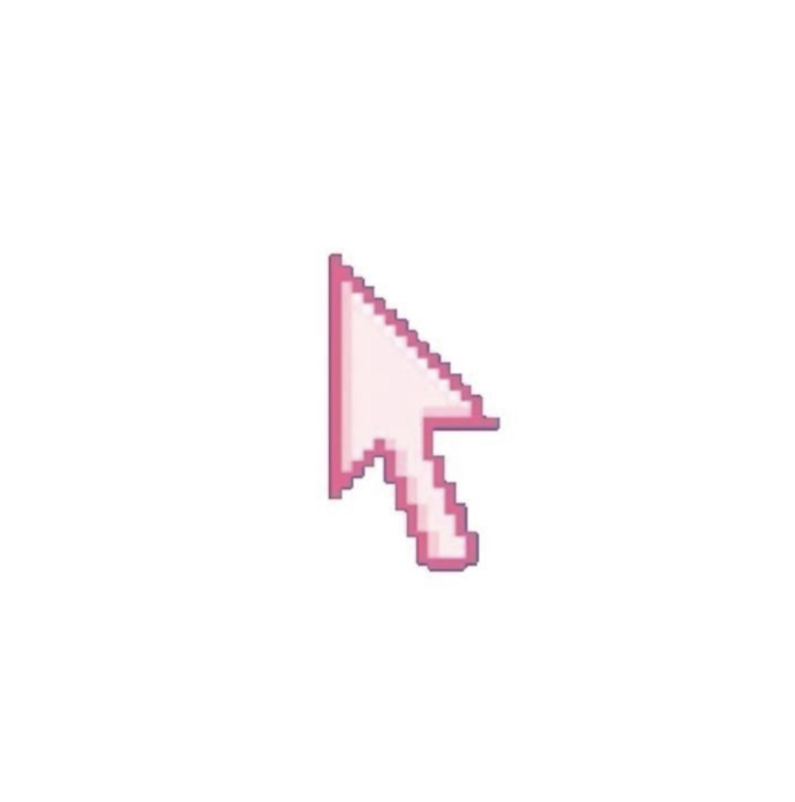
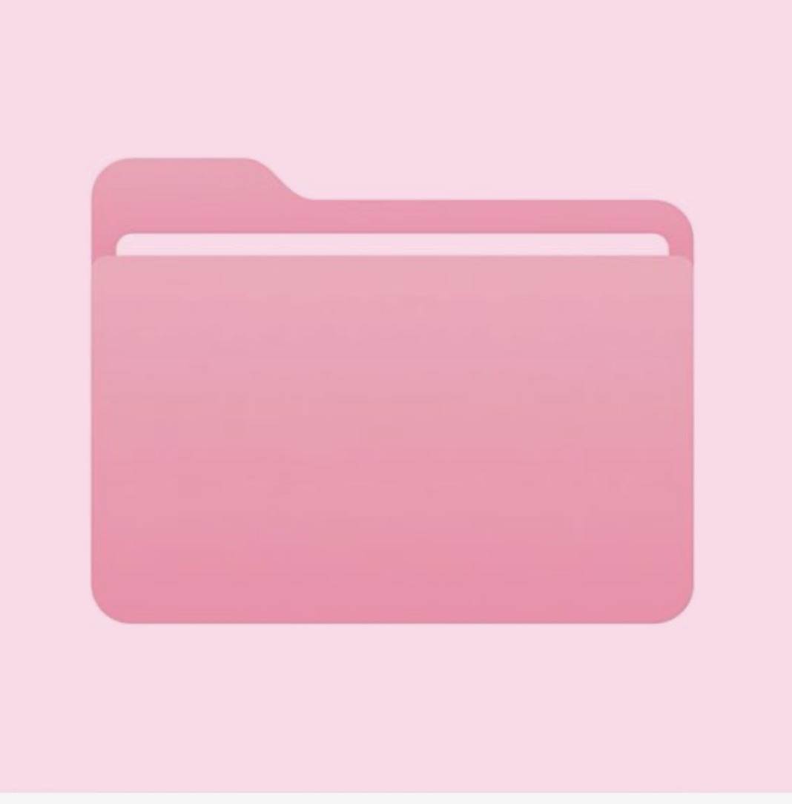
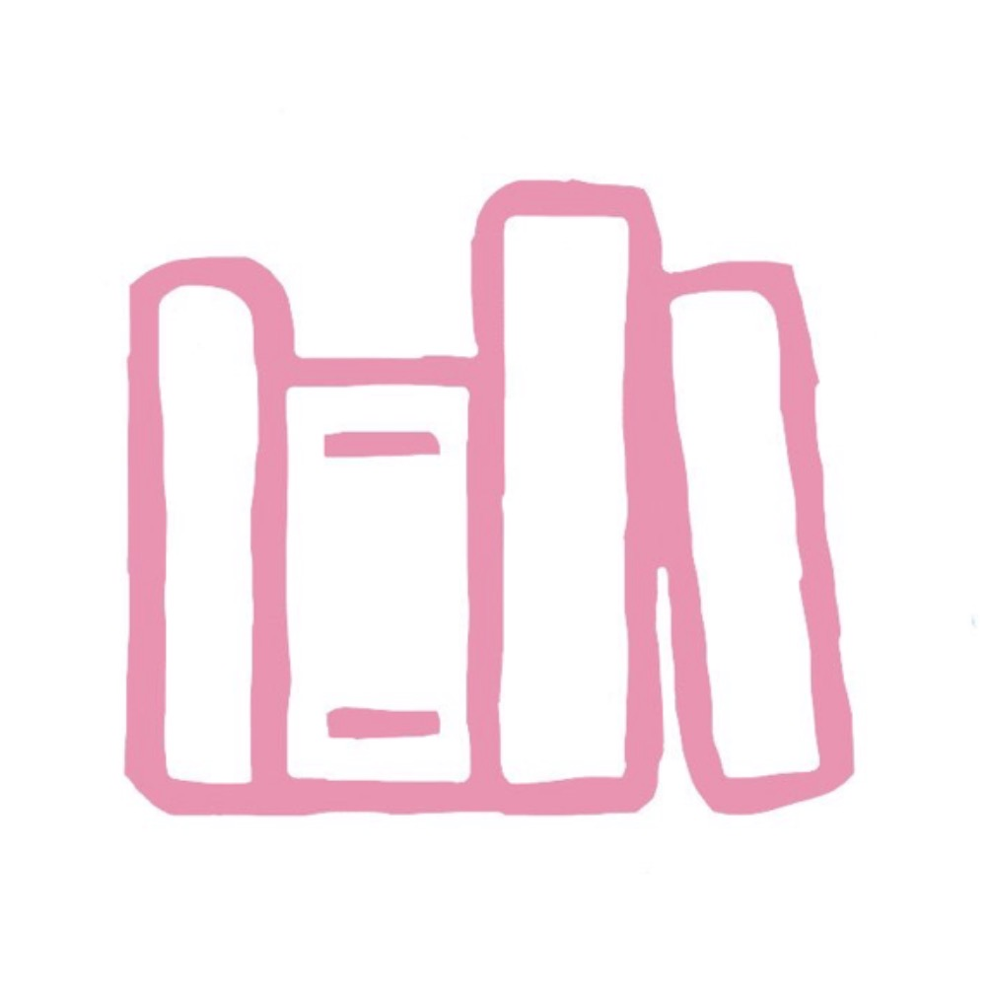

<!-- 🎀 Header Section -->

  

<!-- ✨ Title -->
<h1 align="center" style="color:#ff69b4; font-family: 'Comic Sans MS', cursive;">🌸 Layal Alsowayigh 🌸</h1>
<h3 align="center" style="color:#ff8ccf;">Software Engineer | Computer Science Honors Student</h3>

---

<!-- 🌸 4 Images in a Row -->

  
  
  
  

---

## 🌷 About Me
Hi, I’m **Layal**, a Computer Science **Honors student** on track for Dean’s List at Purdue University Fort Wayne (GPA **3.76**). 

**portfolio** across **C,C++,Python, JavaScript, and Java**.  

✨ Interests:  
- 🌸 **Software Engineering**  
- 💻 **Cybersecurity**  
- 🎨 **Creative Coding & UI Design**

---

## 🌸 Projects
1. **Virtual Glam by Layal (C++17)** — [Virtual-Glam](Virtual-Glam)  
   💄 Makeup catalog app that saves and sorts cosmetic products using file I/O. 

2. **QueueCraft (C++17)** — [QueueCraft](QueueCraft)  
   🚌 Transit boarding simulator with passenger priorities, CSV logging, and Python chart analysis.  
3. **Weather App (Python)** — [WeatherApp-Python](WeatherApp-Python)  
   🌦️ Fetches live weather via OpenWeather API.

4. **To-Do List Web App (HTML/CSS/JS)** — [TodoList-WebApp](TodoList-WebApp)  
   👩‍💻 Interactive task manager with Local Storage.

5. **Circle Catcher (JavaFX)** — [CircleCatcher](CircleCatcher)  
   🎡 Fun desktop game built with JavaFX and FXML.

6. **Trackly (C++17)** — [Trackly](Trackly)  
   📊 Smart inventory & sales tracker with CSV file saving, sorting, and restock alerts.  
💫 *And there’s more!*
---

## 💕 Contact

  
  
  

---

⭐ *Made with love & pink vibes by Layal* 🌸
