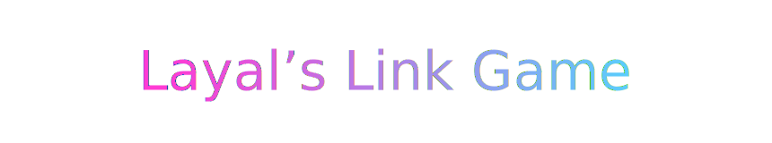

<p align="center">
  
</p>

<p align="center">
  <a href="https://react.dev/"></a>
  <a href="#"></a>
  <a href="#"></a>
</p>

---

## ✨ About the Game

**Layal’s Link Game** is a glowing neon puzzle where you connect matching gems without crossing paths.  
Each level lights up with smooth transitions and animated messages as you advance.  

> 💎 Goal: drag from gem 🔹 to matching gem 🔹 for each color.  
> Paths can’t overlap — complete all pairs to move up!

---

## 🧞‍♀️ Features

- 🎨 **Neon animations** and glowing lines  
- 💿 **Auto-level progression** (L1 → L2 → L3) with celebratory messages  
- 💡 **Hint**, **Undo**, and **Clear** per color  
- 🖱️ Touch + Mouse compatible  
- 🧩 Fully responsive (desktop + mobile)  
- ⚡ Built with **React 18 + Vite + TailwindCSS**

---

## 👩‍💻 Level Messages

| Level | Message |
|:------|:---------|
| 1 | “Yeyy you passed my level 1!” |
| 2 | “You’re a smart software!” |
| 3 | “Yeyyy you completed Layal’s Link Game!” |

---

##  Run Locally

```bash
# 1️⃣ Install dependencies
npm install

# 2️⃣ Start the dev server
npm run dev
